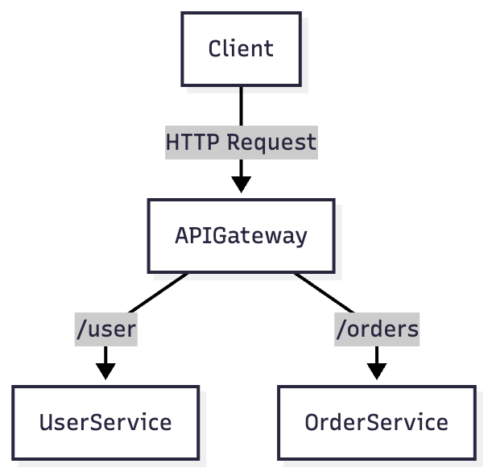

# 🧩 API Gateway + Microservices

### 📘 Problem
How do we route client requests to multiple backend microservices without exposing them directly?

### 🏗️ Architecture
- **API Gateway** routes incoming traffic to `UserService` and `OrderService`.
- Gateway handles:
  - Authentication
  - Rate limiting
  - Aggregating multiple service responses.

### 🧩 Diagram


### ⚙️ Code Overview
```python
# app_gateway.py
from fastapi import FastAPI
import requests

app = FastAPI()

@app.get("/user-orders/{user_id}")
def get_user_orders(user_id: int):
    user = requests.get(f"http://localhost:8001/user/{user_id}").json()
    orders = requests.get(f"http://localhost:8002/orders/{user_id}").json()
    return {"user": user, "orders": orders}